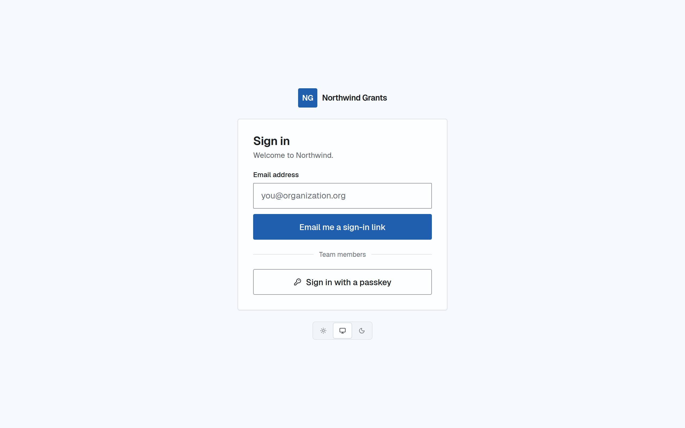
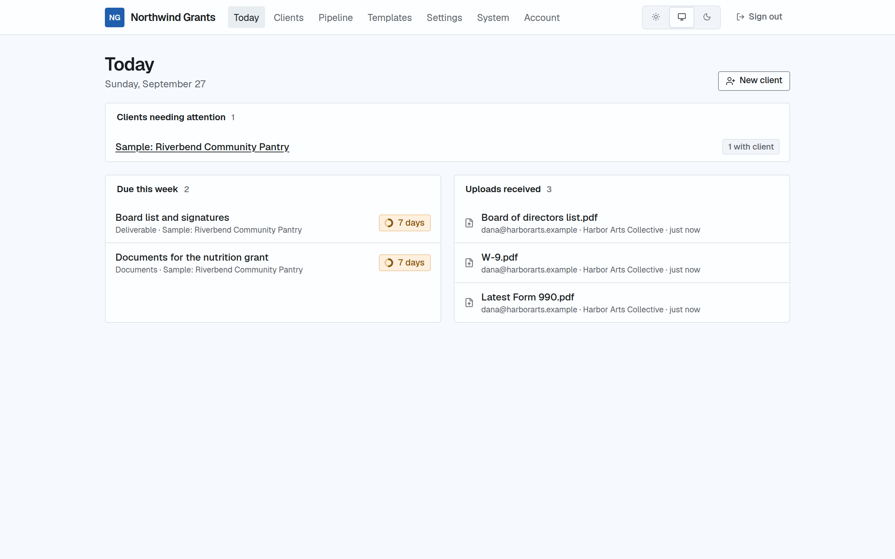
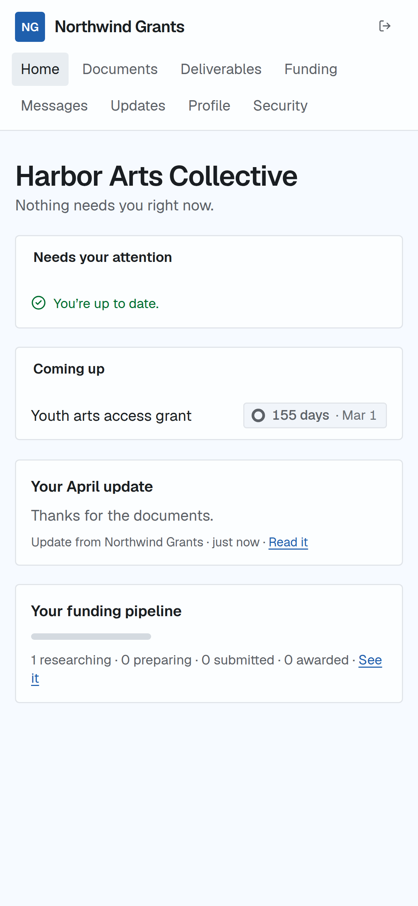

# grant-portal

An open-source, white-label client portal for grant consultants. It runs in your own Cloudflare account and shows your brand, not ours.

[](https://deploy.workers.cloudflare.com/?url=https://github.com/egeria-corporation/grant-portal)

> **Status:** v0.1 release candidate. All milestones in [`docs/PLAN.md`](docs/PLAN.md) are built; the release checklist is [`docs/release.md`](docs/release.md).

<p>
  
  
</p>
<p align="center">
  
</p>

<sub>Screenshots use a sample firm; refresh them with <code>SCREENSHOTS=1 npm run test:e2e</code>.</sub>

## What it does

**For your clients:** a quiet, branded portal that answers two questions: "what do you need from me?" and "what's happening with my funding?"
- Sign in with an emailed link or a 6-digit code. No passwords.
- Upload requested documents: a checklist with drag and drop, resumable uploads, and a clear "received".
- Review and approve drafts, with every version kept.
- Read funding reports and answer each opportunity: **Pursue**, **Not now**, or ask a question.
- See their own funding pipeline, messages, and updates.

**For you and your team:**
- A Today screen of what's due and who's waiting.
- Clients with full profiles (EIN encrypted), document requests with automatic reminders, and a vault with expiry tracking.
- Deliverables with approvals and templates.
- Funding reports you build by hand, from CSV, or (optionally) from OpenGrants, with a branded PDF export.
- A pipeline board per client and across clients.
- Scheduled client updates, digests, calendar (ICS) feeds, and an audit log.

**Yours to run:** one Cloudflare Worker in your account, your brand everywhere (sign-in, emails, PDFs, link previews), your data exportable at any time.

## What you need (5 minutes)

- A **Cloudflare account** (the free plan works to start).
- A **Resend API key** — [resend.com/api-keys](https://resend.com/api-keys). This sends sign-in links and client email.
- A GitHub (or GitLab) account. The Deploy button copies this repository into it so you own your copy and can take updates.

Optional: an **OpenGrants API key** adds grant search, matching, and funding alerts. The portal works fully without it. See [`docs/opengrants.md`](docs/opengrants.md).

## Deploy

1. Click **Deploy to Cloudflare** above and sign in.
2. On the setup page, paste your `RESEND_API_KEY`. Leave `SESSION_SECRET` blank to have one generated on first boot (you'll be reminded to move it into a Worker secret), or paste the output of `openssl rand -hex 32`. `OPENGRANTS_API_KEY` is optional.
3. Cloudflare creates the database (D1), file storage (R2), key-value store (KV), and job queue, builds the app, runs database migrations, and deploys.
4. Open your `*.workers.dev` URL and finish the setup wizard.

Every push to `main` in your copy redeploys automatically. A weekly GitHub Action opens a pull request when upstream has updates (see [Updates](#updates)).

Step-by-step guide with timings: [`docs/deploy.md`](docs/deploy.md).

## Local development

Requirements: Node.js 22+ and npm.

```bash
npm install
cp .dev.vars.example .dev.vars   # optional: fill in what you have
npm run dev                      # SPA + Worker on http://localhost:5173 with local D1/R2/KV
```

`npm run dev` applies database migrations to the local D1 first. Nothing else is required; the Worker generates its own secrets locally when they are blank.

Without `RESEND_API_KEY`, emails aren't sent: sign-in links and codes are printed in the terminal running `npm run dev`. The setup code for claiming the portal is printed there too.

| Command | What it does |
|---|---|
| `npm run dev` | Start the app locally |
| `npm run build` | Production build (needs no secrets) |
| `npm run typecheck` / `npm run lint` | Static checks |
| `npm test` | API and security tests in the Workers runtime, plus build checks |
| `npm run test:e2e` | Playwright end-to-end tests against the production build |
| `npm run db:generate` | Generate a migration after editing `worker/db/schema.ts` |
| `npm run deploy` | Apply remote migrations and deploy with Wrangler |

## Updates

`.github/workflows/sync-upstream.yml` runs weekly (and on demand from the Actions tab). It opens a pull request in your copy with upstream changes. Merging it redeploys through Workers Builds. Database migrations only ever add, so updates are safe to apply.

## Security

- **Sign-in:** magic links with a scanner-safe confirmation step, single-use hashed tokens, and passkeys for staff.
- **Owner controls:** staff email-domain and IP restrictions, and configurable session lengths.
- **Browser protections:** a strict per-request CSP.
- **Authorization:** checked on every route, with an automated cross-client (IDOR) test for each.
- **Data at rest:** sensitive fields are encrypted. Downloads are audited, and the audit log is append-only.
- **Details:** [`docs/security.md`](docs/security.md), including known limitations, and [`docs/SPEC.md` §7](docs/SPEC.md).

Report vulnerabilities privately; see [SECURITY.md](SECURITY.md).

## Documentation

| Guide | For |
|---|---|
| [`docs/deploy.md`](docs/deploy.md) | Deploying, email domain, custom domain, updates |
| [`docs/operations.md`](docs/operations.md) | Running the portal: team, security settings, export, deleting a client, retention, demo mode |
| [`docs/theming.md`](docs/theming.md) | Brand, colours, logos |
| [`docs/opengrants.md`](docs/opengrants.md) | The optional OpenGrants integration and its request budget |
| [`docs/security.md`](docs/security.md) | Security model and known limitations |
| [`docs/self-hosting-faq.md`](docs/self-hosting-faq.md) | Costs, limits, backups, common questions |

## Contributing

Contributions are welcome; see [CONTRIBUTING.md](CONTRIBUTING.md) and the [Code of Conduct](CODE_OF_CONDUCT.md).

## License

[Apache-2.0](LICENSE).
